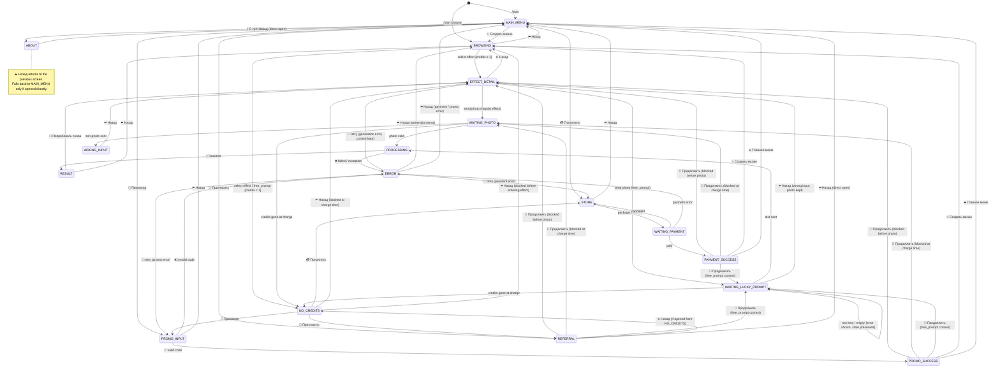
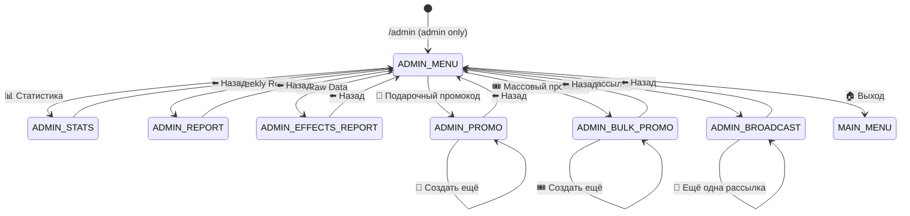

# UI Flow — Photo Bot (Target v3)

This file is the target UX spec.
It defines the desired user flow first, then code should be compared against it.
It is intentionally not a promise that the current bot already behaves this way.


## UX Principles
1. Never dead-end after success. Every success state must offer a clear next action.
2. Preserve context. If the user hits a paywall or a recoverable error, return them to the exact step they were on.
3. Keep momentum. After generation, keep the result photo and place the next interactive screen below it.
4. Global shortcuts must always work. `✨ / 💳 / 🎁 / 👥 / ℹ️` should be available from all user-facing states.
5. One clear way back. Every screen should have one obvious back action.
6. Progress should be cheap. If the user already sent a photo or prompt, avoid making them redo it unless impossible.
7. This bot uses only two UI flow types: `Anchor-Based Hybrid Edit-in-Place Flow` and `Conversational Flow`.
8. The default and preferred pattern is `Anchor-Based Hybrid Edit-in-Place Flow`; `Conversational Flow` should be used only when it clearly improves the experience or is required by Telegram constraints.
9. Any proposed UI/UX change must explicitly answer whether that step should remain `Anchor-Based Hybrid Edit-in-Place Flow` or switch to `Conversational Flow`, and why.

---

## State Map

### User Flow



### Admin Flow



---

```
LEGEND
  🖼️  = image required    🖼️* = image optional (text-only if missing)
  📝  = text              ⌨️  = inline keyboard    ⚠️ = edge case / error
  🪟  = Anchor-Based Hybrid Edit-in-Place Flow
  💬  = Conversational Flow
  🪟/💬 = can render either way, depending on entry point
  {placeholder} = runtime value filled by the bot

Flow markers show the TARGET rendering for each screen.
Quoted `text:` lines show the target copy or a template with placeholders.

━━━━━━━━━━━━━━━━━━━━━━━━━━━━━━━━━━━━━━━━━━━━━━━━━━━━━━━━━━━━━━━━━━━━━━━━━━

USER FLOW

/start
├── (default / referral deep link / source deep link) MAIN MENU  [🖼️* 📝 reply-KB | 💬]
│   ├── text: "Привет, {name}!\n⚡ Доступно зарядов: {credits}\nВыбери действие 👇"
│   ├── ✨ Создать магию
│   │   └── BROWSING root  [🖼️* 📝 ⌨️ | 🪟]
│   │       ├── text: "⚡ Доступно зарядов: {credits}"
│   │       ├── [Category]  [🖼️* 📝 ⌨️ | 🪟]
│   │       │   ├── text: "{category_name}"
│   │       │   ├── [Effect]
│   │       │   │   ├── ⚠️ credits < 1 → NO CREDITS  [📝 ⌨️ | 🪟]
│   │       │   │   │       ├── text: "😮‍💨 Заряды кончились. Бывает.\n\nНо останавливаться необязательно:\n\n💳 Пополнить → от 99 ₽\n👥 Пригласить друга → +3 заряда бесплатно"
│   │       │   │   │       ├── 💳 Пополнить → STORE
│   │       │   │   │       ├── 🎁 Промокод → PROMO_INPUT
│   │       │   │   │       ├── 👥 Пригласить друга → REFERRAL
│   │       │   │   │       └── ⬅️ Назад → [Category]
│   │       │   │   └── credits ≥ 1 → EFFECT DETAIL  [🖼️* 📝 ⌨️ | 🪟]
│   │       │   │           ├── text template: "{tips}[ + '\n\n📷 Лучше всего подойдёт: {best_input}']\n\nОтправь мне фото для обработки 👇"
│   │       │   │           ├── tips / best input / example image (if present)
│   │       │   │           ├── ⬅️ Назад → [Category]
│   │       │   │           └── [send photo] → WAITING_PHOTO
│   │       │   │                   ├── [non-photo] → WRONG_INPUT  [📝 ⌨️ | 💬]
│   │       │   │                   │       ├── text: "📸 Сначала фото — потом магия!"
│   │       │   │                   │       └── ⬅️ Назад → EFFECT DETAIL
│   │       │   │                   ├── [send photo] → ⏳ processing
│   │       │   │                   │       ├── text: "⏳ Создаю магию..."
│   │       │   │                   │       └── ✅ result photo  [🖼️ 📝 ⌨️ | 💬] ← never auto-deleted; old anchor deleted
│   │       │   │                   │               ├── caption: "✅ {effect_label}\n⚡ Осталось зарядов: {remaining}"
│   │       │   │                   │               ├── 🔄 Попробовать снова → EFFECT DETAIL
│   │       │   │                   │               └── ⬅️ Назад → parent category or BROWSING root
│   │       │   │                   └── ⚠️ no credits at charge time → NO CREDITS (context kept)  [📝 ⌨️ | 💬]
│   │       │   │                           ├── text: "😮‍💨 Заряды кончились. Бывает.\n\nНо останавливаться необязательно:\n\n💳 Пополнить → от 99 ₽\n👥 Пригласить друга → +3 заряда бесплатно"
│   │       │   │                           ├── 💳 Пополнить → STORE
│   │       │   │                           ├── 🎁 Промокод → PROMO_INPUT
│   │       │   │                           ├── 👥 Пригласить друга → REFERRAL
│   │       │   │                           └── ⬅️ Назад → EFFECT DETAIL
│   │       │   ├── [Subcategory]  (same pattern; ⬅️ goes to parent category)
│   │       │   └── ⬅️ Назад → parent category or BROWSING root
│   │       ├── [Top-level effect]
│   │       │   └── same flow as [Category] → [Effect], but ⬅️ returns to BROWSING root
│   │       ├── 🎲 Попробуй свой PROMPT 🔥  (free_prompt)
│   │       │   ├── ⚠️ credits < 1 → NO CREDITS  [📝 ⌨️ | 🪟]
│   │       │   │       ├── text: "😮‍💨 Заряды кончились. Бывает.\n\nНо останавливаться необязательно:\n\n💳 Пополнить → от 99 ₽\n👥 Пригласить друга → +3 заряда бесплатно"
│   │       │   │       ├── 💳 Пополнить → STORE
│   │       │   │       ├── 🎁 Промокод → PROMO_INPUT
│   │       │   │       ├── 👥 Пригласить друга → REFERRAL
│   │       │   │       └── ⬅️ Назад → BROWSING root
│   │       │   └── credits ≥ 1 → EFFECT DETAIL  [📝 ⌨️ | 🪟]
│   │       │           ├── (default) text: "Отправь своё фото и опиши что хочешь с ним сделать — AI исполнит.\n\nОтправь мне фото для обработки 👇"
│   │       │           ├── (photo retained) text: "✅ Фото сохранено.\n\nНапиши свой PROMPT или отправь другое фото 👇"
│   │       │           ├── ⬅️ Назад → BROWSING root
│   │       │           └── [send photo] → WAITING_LUCKY_PROMPT  [📝 ⌨️ | 💬]
│   │       │                   ├── text: "✅ Фото получено!\n\nТеперь напиши свой PROMPT 👇"
│   │       │                   ├── ✅ Фото получено! Теперь напиши свой PROMPT
│   │       │                   ├── [non-text] → WRONG_INPUT  [📝 ⌨️ | 🪟]  (stay WAITING_LUCKY_PROMPT)
│   │       │                   │       ├── text: "Мне нужен текст, а не это 😄 Напиши словами что сделать с фото"
│   │       │                   │       └── ⬅️ Назад → EFFECT DETAIL  (photo kept)
│   │       │                   ├── [empty text / spaces] → WRONG_INPUT  [📝 | 💬]  (stay WAITING_LUCKY_PROMPT)
│   │       │                   │       └── text: "✏️ Пустой запрос не считается 🙈 Напиши что-нибудь!"
│   │       │                   ├── [send text] → ⏳ processing
│   │       │                   │       ├── text: "⏳ Создаю магию..."
│   │       │                   │       ├── ✅ result photo  [🖼️ 📝 ⌨️ | 💬]  ← never auto-deleted; old anchor deleted
│   │       │                   │       │       ├── caption: "✅ {effect_label}\n⚡ Осталось зарядов: {remaining}"
│   │       │                   │       │       ├── 🔄 Попробовать снова → EFFECT DETAIL
│   │       │                   │       │       └── ⬅️ Назад → BROWSING root
│   │       │                   │       ├── ⚠️ model returned no image → ERROR  [📝 ⌨️ | 🪟]
│   │       │                   │       │       ├── text template: "❌ Что-то пошло не так\n\nКредит возвращён.\n⚡ Доступно зарядов: {new_balance}"
│   │       │                   │       │       ├── 🔄 Попробовать снова → EFFECT DETAIL  (photo kept)
│   │       │                   │       │       └── ⬅️ Назад → BROWSING root
│   │       │                   │       └── ⚠️ exception → ERROR  [📝 ⌨️ | 🪟]  (same buttons)
│   │       │                   │               └── text template: "❌ Что-то пошло не так\n\nКредит возвращён.\n⚡ Доступно зарядов: {new_balance}\n\nОшибка: {error[:100]}"
│   │       │                   └── ⚠️ no credits at charge time → NO CREDITS (photo + prompt kept)  [📝 ⌨️ | 💬]
│   │       │                           ├── text: "😮‍💨 Заряды кончились. Бывает.\n\nНо останавливаться необязательно:\n\n💳 Пополнить → от 99 ₽\n👥 Пригласить друга → +3 заряда бесплатно"
│   │       │                           ├── 💳 Пополнить → STORE
│   │       │                           ├── 🎁 Промокод → PROMO_INPUT
│   │       │                           ├── 👥 Пригласить друга → REFERRAL
│   │       │                           └── ⬅️ Назад → EFFECT DETAIL
│   │       └── ⬅️ Назад → MAIN MENU
│   │
│   ├── 💳 Пополнить запасы
│   │   └── STORE  [📝 ⌨️ | 🪟/💬]
│   │       ├── text: "Выбери пакет:"
│   │       ├── 10 зарядов — 99 ₽  ─┐
│   │       ├── 25 зарядов — 229 ₽  ├─► WAITING_PAYMENT  [📝 native invoice | 💬]
│   │       │       ├── invoice title: "Пакет {credits} зарядов"
│   │       │       ├── invoice description: "Пополнение баланса на {credits} зарядов"
│   │       │       ├── cancel text: "Нажми кнопку ниже, чтобы отменить покупку:"
│   │       │       └── ⚠️ reply-KB global shortcuts unavailable while native invoice is active; user must cancel first
│   │       ├── 50 зарядов — 399 ₽  │       ├── [pay] → SUCCESS  [📝 ⌨️ | 💬]
│   │       │                       │       └── text: "✅ Оплата прошла!\n+{credits} зарядов добавлено\n\n⚡ Доступно зарядов: {new_balance}"
│   │       ├── 100 зарядов — 699 ₽─┘       │       ├── if return-context exists → 🔄 Продолжить
│   │       │                                │       │       └── return to blocked step / preserved state
│   │       │                                │       ├── ✨ Создать магию → BROWSING root
│   │       │                                │       └── ⬅️ Главное меню → MAIN MENU
│   │       ├── ⬅️ Назад → MAIN MENU         ├── ⬅️ Назад (cancel) → STORE
│   │       └──                              └── ⚠️ payment send error → ERROR  [📝 ⌨️ | 💬]
│   │                                               ├── text template: "❌ Ошибка платежа: {error}\n\nПопробуйте позже."
│   │                                               ├── 🔄 Попробовать снова → STORE
│   │                                               └── ⬅️ Главное меню → MAIN MENU
│   │
│   ├── 🎁 Промокод
│   │   └── PROMO_INPUT  [📝 ⌨️ | 🪟/💬]
│   │       ├── text: "Введи промокод:"
│   │       ├── [type code] ✅ valid   → SUCCESS  [📝 ⌨️ | 💬]
│   │       │       ├── text: "✅ Промокод активирован!\n+{credits} зарядов добавлено\n\n⚡ Доступно зарядов: {new_balance}"
│   │       │       ├── if return-context exists → 🔄 Продолжить
│   │       │       │       └── return to blocked step / preserved state
│   │       │       ├── ✨ Создать магию → BROWSING root
│   │       │       └── ⬅️ Главное меню → MAIN MENU
│   │       ├── [type code] ❌ invalid → ERROR  [📝 ⌨️ | 💬]
│   │       │       ├── text template: "❌ {db_message}"
│   │       │       ├── 🔄 Попробовать другой → PROMO_INPUT
│   │       │       └── ⬅️ Назад → MAIN MENU
│   │       └── ⬅️ Назад → MAIN MENU
│   │
│   ├── 👥 Пригласить друга
│   │   └── REFERRAL  [📝 ⌨️ | 🪟/💬]
│   │       ├── text: "Приглашай друзей и получай\n+3 заряда за каждого!\n\nТвоя ссылка:\n{ref_link}"
│   │       ├── show reward rule + personal link
│   │       ├── if opened from a blocked state → 🔄 Продолжить → previous blocked step
│   │       └── ⬅️ Назад → previous screen (or MAIN MENU if opened directly)
│   │
│   └── ℹ️ О проекте
│       └── ABOUT  [📝 ⌨️ | 🪟/💬]
│           ├── text: "ℹ️ О проекте\n\nПроект предназначен для людей достигших возраста 18+ и демонстрирует работу нейросетей.\n\nВсе созданные изображения не могут быть использованы для рекламных или иных порочащих репутацию других граждан целей.\n\nЕсли вам кажется что ваши права нарушены или у вас возникли вопросы/предложения по работе проекта – пишите в нашу поддержку."
│           ├── support button (external, only if configured)
│           └── ⬅️ Назад → previous screen (or MAIN MENU if opened directly)
│
└── /start browse
    └── BROWSING root directly  [🖼️* 📝 ⌨️ | 🪟]  (new anchor message sent since there is no prior anchor)
        └── text: "⚡ Доступно зарядов: {credits}"

Notes
  - Reply-keyboard shortcuts remain active in every user-facing state.
  - Switching tasks from the reply keyboard is allowed, but recoverable create-flow context should be preserved until the user completes, cancels, or restarts.
  - Result photos with `✅` captions are always preserved in chat.
  - The next interactive create screen should appear below the result, not above it.

━━━━━━━━━━━━━━━━━━━━━━━━━━━━━━━━━━━━━━━━━━━━━━━━━━━━━━━━━━━━━━━━━━━━━━━━━━

ADMIN FLOW

ADMIN  (/admin, ADMIN_ID only)
└── ADMIN_MENU  [📝 ⌨️ | 💬]
    ├── text: "🔐 Админ-панель"
    ├── 📊 Статистика → ADMIN_STATS  [📝 ⌨️ | 🪟]
    │       └── ⬅️ Назад → ADMIN_MENU
    ├── 📈 Weekly Report → ADMIN_REPORT  [📝 ⌨️ | 🪟]
    │       └── ⬅️ Назад → ADMIN_MENU
    ├── 🗂 Raw Data → ADMIN_EFFECTS_REPORT  [📝 ⌨️ | 🪟]
    │       ├── text: "🗂 Raw Data — выбери формат:"
    │       ├── 📊 XLSX → sends file → SUCCESS  [📝 ⌨️ | 🪟]
    │       │       ├── progress text: "⏳ Generating XLSX export..."
    │       │       ├── success text: "✅ XLSX sent! (Users / Generations / Purchases)"
    │       │       └── ⬅️ Назад → ADMIN_MENU
    │       ├── 📄 CSV (zip) → sends file → SUCCESS  [📝 ⌨️ | 🪟]
    │       │       ├── progress text: "⏳ Generating CSV export..."
    │       │       ├── success text: "✅ CSV sent! (users.csv / generations.csv / purchases.csv)"
    │       │       └── ⬅️ Назад → ADMIN_MENU
    │       ├── ⚠️ export failed → ERROR  [📝 ⌨️ | 🪟]
    │       │       ├── text template: "❌ Export failed: {error}"
    │       │       ├── 🔄 Повторить → same export
    │       │       └── ⬅️ Назад → ADMIN_MENU
    │       └── ⬅️ Назад → ADMIN_MENU
    ├── 🎁 Подарочный промокод → ADMIN_PROMO  [📝 ⌨️ | 🪟]
    │       ├── text: "🎁 Создать промокод\n\nСколько зарядов даёт промокод?"
    │       ├── choose credits → PROMO CREATED  [📝 ⌨️ | 🪟]
    │       │       ├── text: "✅ Промокод создан!\n\nКод: {code}\nДаёт: +{amount} зарядов"
    │       │       ├── 🎁 Создать ещё → ADMIN_PROMO
    │       │       └── ⬅️ Назад → ADMIN_MENU
    │       └── ⬅️ Назад → ADMIN_MENU
    ├── 🎟 Массовый промокод → ADMIN_BULK_PROMO  [📝 ⌨️ | 🪟]
    │       ├── Step 1 text: "🎟 Массовый промокод\n\nШаг 1/3 — Сколько зарядов даёт промокод?"
    │       ├── Step 2 text: "🎟 Массовый промокод\n\nЗарядов: {credits}\nШаг 2/3 — Сколько раз можно использовать?"
    │       ├── Step 3 text: "🎟 Массовый промокод\n\nЗарядов: {credits} · Использований: {uses}\nШаг 3/3 — Срок действия?"
    │       ├── BULK PROMO CREATED  [📝 ⌨️ | 🪟]
    │       │       ├── text: "✅ Массовый промокод создан!\n\nКод: {code}\nЗарядов: +{credits}\nМакс. использований: {uses}\nИстекает: {dd.mm.yyyy}"
    │       │       ├── 🎟 Создать ещё → ADMIN_BULK_PROMO
    │       │       └── ⬅️ Назад → ADMIN_MENU
    │       └── ⬅️ Назад → ADMIN_MENU
    ├── 📢 Рассылка новых эффектов → ADMIN_BROADCAST  [📝 ⌨️ | 🪟]
    │       ├── text template: "📢 Рассылка новых эффектов (N5)\n\nПолучателей: {count} (активные за 14 дней)\n\nОтправь список новых эффектов (каждый с новой строки).\nНапример:\n🎭 Гангстер из 90-х\n👑 Египетский фараон"
    │       ├── show recipient count
    │       ├── [type effects list] → SEND BROADCAST
    │       ├── ⏳ progress text  [📝 | 💬]
    │       │       └── text: "⏳ Отправляю {len(users)} пользователям..."
    │       ├── ✅ finished  [📝 ⌨️ | 💬]
    │       │       ├── text: "✅ Рассылка завершена!\nОтправлено: {sent_count}/{len(users)}"
    │       │       ├── 📢 Ещё одна рассылка → ADMIN_BROADCAST
    │       │       └── ⬅️ Админ-панель → ADMIN_MENU
    │       └── ⬅️ Назад → ADMIN_MENU
    └── 🏠 Выход → MAIN MENU

━━━━━━━━━━━━━━━━━━━━━━━━━━━━━━━━━━━━━━━━━━━━━━━━━━━━━━━━━━━━━━━━━━━━━━━━━━

EDGE CASES

⚠️ User sends photo, but selected effect is missing / session expired:
    [📝 ⌨️ | 💬]
    ├── text: "❌ Сессия истекла\n\nНажми кнопку ниже, чтобы начать заново:"
    ├── 🔄 Начать заново → MAIN MENU
    └── if recoverable context exists → 🔄 Вернуться → previous valid step

⚠️ User sends text prompt, but stored photo/effect is missing:
    [📝 ⌨️ | 💬]
    ├── text: "❌ Сессия истекла\n\nНажми кнопку ниже, чтобы начать заново:"
    └── 🔄 Начать заново → MAIN MENU

⚠️ User opens an invalid category or stale effect:
    [📝 ⌨️ | 🪟]
    ├── invalid category text: "❌ Категория не найдена\n\nНажми кнопку ниже, чтобы начать заново:"
    ├── stale effect text: "❌ Неизвестный эффект\n\nНажми кнопку ниже, чтобы начать заново:"
    ├── 🔄 Начать заново → MAIN MENU
    └── ✨ К выбору эффектов → BROWSING root

⚠️ User taps an old button after bot restart / redeploy:
    spinner dismissed quickly
    ├── if callback can be safely remapped → intended target
    └── else → MAIN MENU  [🖼️* 📝 reply-KB | 💬]
    (result photos with `✅` captions are never deleted in this process)

⚠️ User sends unsolicited photo or text while in MAIN MENU / BROWSING root / category screens:
    [📝 | 💬]
    └── text: "📸 Сначала выбери эффект, потом отправляй фото 👇"
        (no state change; user remains on current screen)

⚠️ Non-admin user runs /admin:
    access denied text  [📝 | 💬]
    └── text: "Доступ запрещён. (Your ID: {user_id})"

━━━━━━━━━━━━━━━━━━━━━━━━━━━━━━━━━━━━━━━━━━━━━━━━━━━━━━━━━━━━━━━━━━━━━━━━━━
```
